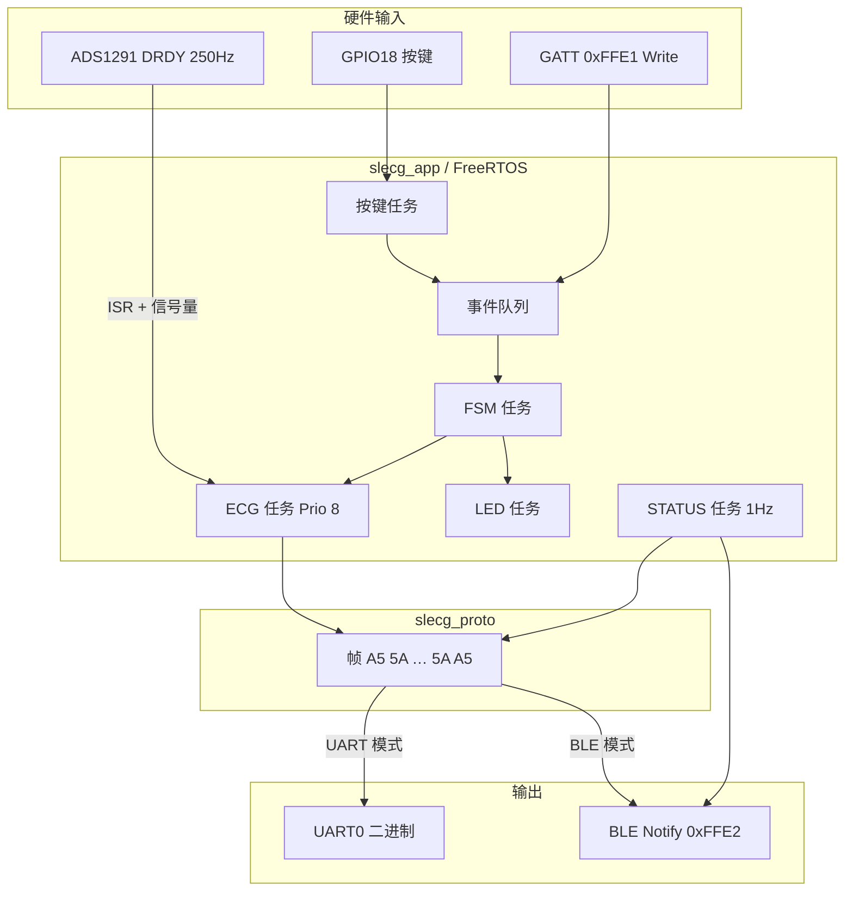

# ESP32S3 SL-ECG

> **一颗芯片，两种通道，一条心跳。**  
> 基于 ESP32-S3 的单导联可穿戴心电采集固件 —— 把 ADS1291 的 **250 Hz** 波形，通过 **UART 有线** 或 **BLE 无线** 送到你的上位机。

```
   皮肤电极                ESP32-S3                    上位机
  ┌────────┐    SPI/DRDY   ┌──────────┐   UART0 / BLE   ┌─────────┐
  │ ADS1291│ ────────────► │ SLECG    │ ──────────────► │ 波形 UI │
  │  1ch   │   250 Hz      │ 固件     │   A5 5A 帧      │  存储   │
  └────────┘               └──────────┘                 └─────────┘
                                │
                           GPIO18 按键
                           GPIO41 绿灯 / GPIO42 蓝灯
```

---

## 这个项目做什么？

**ESP32S3 SL-ECG** 是一套面向论文与原型开发的嵌入式心电采集方案：

| 能力 | 说明 |
|------|------|
| **硬件前端** | TI ADS1291，单通道，250 SPS，24-bit 采样 + 数字带通/陷波 |
| **双传输模式** | 绿灯 = UART0 有线二进制流；蓝灯 = BLE GATT Notify |
| **本地人机交互** | 一个按键完成模式切换与启停采集，双色 LED 反馈状态 |
| **统一协议** | UART 与 BLE 共用 `A5 5A … 5A A5` 帧格式（见 [`ble_protocol/`](ble_protocol/)） |
| **PC 上位机** | [`host_app/`](host_app/)：PyQt6 实时波形、串口/BLE、CSV 录波 |
| **模块化固件** | 驱动 / 协议 / 应用分层，FreeRTOS 多任务，便于扩展 IMU、电池等 |

上电后设备默认进入 **UART 有线模式**（绿灯常亮、未采集）。你可以接串口抓包做实验，也可以长按切到蓝牙模式，用手机或 PC 连 `ESP_SLECG` 收波形。

---

## 30 秒上手：看灯就懂

设备用 **两个维度** 表达状态：**传哪里**（颜色）和 **采不采**（亮法）。

| 指示灯 | 传输模式 | 常亮 | 1.5 s 翻转闪烁 |
|--------|----------|------|----------------|
| **绿灯** GPIO41 | UART 有线 | 已选 UART，**未采集** | 正在 UART 输出 ECG |
| **蓝灯** GPIO42 | BLE 无线 | 已选 BLE，**未采集** | 正在 BLE Notify ECG |

| 操作 | 效果 |
|------|------|
| **单击** GPIO18 | 在当前模式下 **开始 / 停止** 采集 |
| **长按 3 s** | 切换 UART ↔ BLE（采集中会先自动停止） |

> BLE 模式下，单击开始前需：**已连接** 且 **已开启 Notify（写 CCCD）**，否则蓝灯会快闪提示。

传输模式会写入 NVS，重启后自动恢复；采集状态不保存，每次上电均为停止。

---

## 工程结构导览

```
ESP32S3_SLECG_CODE/
├── main/                      # 入口：初始化 + 启动应用层
│   ├── main.c
│   └── board_pins.h           # 板级 GPIO 定义（ADS SPI/控制脚）
├── components/
│   ├── ads129x/               # ADS1291 SPI 驱动（滤波、PWDN/START、RDATAC）
│   ├── ble_slecg/             # BLE GATT 服务 0xFFE0/FFE1/FFE2
│   ├── slecg_proto/           # 协议层：帧封装、ECG/STATUS 组包
│   └── slecg_app/             # 应用层：FSM、任务、按键、LED、传输路由
├── host_app/                  # PC 上位机（PyQt6 + 串口/BLE）
├── ble_protocol/              # 协议规范文档（上位机对接必读）
├── .cursor/skills/            # 工程 Agent Skill（日志交叉对比等）
└── sdkconfig.defaults         # ESP32-S3 + BLE 默认配置
```

> **现状说明（开发中）**：UART 数据链路已可打通（寄存器可读、ECG 帧可上送到 host）。仍可能出现波形冲顶、间歇全 0（与 PWDN 读回/供电/电极相关）等问题，详见提交说明与 `host_app/README.md`。

### 分层设计：为什么这样拆？

```
┌─────────────────────────────────────────────────────────┐
│  main.c          只做「接线员」：init → slecg_app_start  │
├─────────────────────────────────────────────────────────┤
│  slecg_app       业务编排：FSM、按键、LED、ECG 任务      │
├─────────────────────────────────────────────────────────┤
│  slecg_proto     纯协议：与硬件无关，可给上位机复用常量    │
├─────────────────────────────────────────────────────────┤
│  ads129x         芯片驱动：SPI、START/PWDN、读帧         │
│  ble_slecg       传输驱动：Bluedroid GATT               │
└─────────────────────────────────────────────────────────┘
```

**原则：** 驱动不知道协议，协议不知道按键；所有业务决策集中在 **FSM 任务**，避免逻辑堆进 `main.c`。

---

## 运行时架构



### FreeRTOS 任务一览

| 任务 | 优先级 | 职责 |
|------|--------|------|
| `slecg_ecg` | 8 | DRDY 中断触发，500 Hz 读帧，每 25 点封一包 ECG_DATA |
| `slecg_fsm` | 6 | 处理按键/BLE 事件，启停 ADS1291，切换传输模式 |
| `slecg_status` | 4 | 1 Hz 发送 DEVICE_STATUS（仅 BLE） |
| `slecg_btn` | 4 | 按键消抖，区分单击 / 长按 3 s |
| `slecg_led` | 3 | 根据 FSM 状态刷新双色 LED |

同步手段：**事件队列**（FSM 输入）、**计数信号量**（DRDY → ECG）、**全局运行时快照** `slecg_runtime_t`（各模块只读）。

---

## 数据从哪来，到哪去？

### 1. 采集链路

```
DRDY 下降沿 → ads129x_read_frame() → ch1_value (int16)
    → 缓冲 25 样本 → slecg_proto_build_ecg_frame() → 66 字节帧
    → slecg_transport_send_data() → UART0 或 BLE
```

- 采样率：`ADS129X_SAMPLE_RATE_HZ = 500`
- 包率：500 ÷ 25 = **20 包/秒**
- 样本来源：驱动内 24-bit 符号扩展 + 右移压缩后的 `int16_t`

### 2. 协议帧（UART 与 BLE 通用）

```
 A5 5A | TYPE | LEN(LE) | PAYLOAD | 5A A5
```

| TYPE | 名称 | 本固件 |
|------|------|--------|
| `0x20` | ECG_DATA | 采集中 20 Hz 发送 |
| `0x30` | DEVICE_STATUS | BLE 连接后 1 Hz |
| `0x10/0x11` | START/STOP | 仅 BLE 模式下接受 |
| `0x01/0x02` | ACK/NACK | BLE Notify 应答 |

完整字段定义 → [`ble_protocol/README.md`](ble_protocol/README.md)

### 3. UART 模式的特殊处理

UART 采集运行时，固件会 **`esp_log_level_set("*", ESP_LOG_NONE)`**，避免日志字节污染二进制流。调试日志仍可通过 **USB Serial JTAG** 查看。

---

## 硬件管脚（ESP32S3_SL_ECG）

| GPIO | 功能 |
|------|------|
| 1 | 电池 ADC（预留，未启用） |
| **3** | ADS1291 DRDY |
| **46** | ADS1291 DOUT（MISO） |
| **9** | ADS1291 SCLK |
| **10** | ADS1291 DIN（MOSI） |
| **11** | ADS1291 CS |
| **12** | ADS1291 START |
| **13** | ADS1291 PWDN |
| **18** | **用户按键**（按下拉低） |
| **41** | **绿灯** — UART 模式指示 |
| **42** | **蓝灯** — BLE 模式指示 |

定义见 [`main/board_pins.h`](main/board_pins.h)。

---

## 构建与烧录

**环境：** ESP-IDF v5.5.x，目标 `esp32s3`

```bash
idf.py set-target esp32s3
idf.py build
idf.py -p /dev/tty.usbserial-XXX flash monitor
```

> 首次克隆后，`sdkconfig.defaults` 已启用 BLE Bluedroid；完整配置会在首次 `build` 时生成 `sdkconfig`。

### 串口抓 ECG（UART 模式）

1. 上电确认 **绿灯常亮**
2. **单击** → 绿灯开始 1.5 s 闪烁
3. 用 115200 8N1 打开 UART0，按 `A5 5A` 同步解析 TYPE `0x20` 帧（66 字节）

### 蓝牙收 ECG（BLE 模式）

1. **长按 3 s** → 蓝灯常亮
2. 扫描并连接 **`ESP_SLECG`**
3. 写 **0xFFE2** 的 CCCD = `0x0001` 开启 Notify
4. 单击开始，或发送 `START_ACQ`：`A5 5A 10 02 00 00 5A A5`

---

## 开发者教程：如何读代码？

建议按以下顺序阅读，像剥洋葱一样从外到内：

### 第一步：入口

[`main/main.c`](main/main.c) — 仅四步：`ble_slecg_init` → `ads129x_init` → `slecg_app_start`。

### 第二步：应用启动

[`components/slecg_app/slecg_app.c`](components/slecg_app/slecg_app.c) — 创建事件队列，依次启动 FSM / 协议处理器 / 按键 / LED / ECG / STATUS。

### 第三步：状态机（核心）

[`components/slecg_app/slecg_fsm.c`](components/slecg_app/slecg_fsm.c)

- 维护 `transport_mode` × `acq_state` 两个枚举
- 所有 **单击、长按、BLE START/STOP** 最终都变成队列里的 `slecg_event_t`
- 启停 ADS：`ads129x_init_start()`（首次）/ `ads129x_start()` / `ads129x_stop()`

### 第四步：数据面

| 文件 | 关注点 |
|------|--------|
| [`slecg_ecg.c`](components/slecg_app/slecg_ecg.c) | DRDY ISR、500 Hz 读帧、组包 |
| [`slecg_transport.c`](components/slecg_app/slecg_transport.c) | UART / BLE 路由 |
| [`slecg_proto_payload.c`](components/slecg_proto/slecg_proto_payload.c) | ECG_DATA / STATUS 字节布局 |

### 第五步：驱动与 BLE

| 文件 | 关注点 |
|------|--------|
| [`ads129x.c`](components/ads129x/ads129x.c) | SPI、RDATAC、寄存器默认值 |
| [`ble_slecg.c`](components/ble_slecg/ble_slecg.c) | GATT 表、Notify、RX 回调 |

---

## 扩展指南

想加新功能？对照下表找落点：

| 你想做… | 建议修改 |
|---------|----------|
| 改采样率 / PGA | `ads129x.h` 宏 + `ads129x_configure_default` |
| 加 IMU 50 Hz 上报 | 新建 `slecg_imu` 任务，组 TYPE `0x40` 帧 |
| 启用电池 ADC | 实现 `slecg_battery` 任务，GPIO1，TYPE `0x50` |
| 上位机新指令 | `ble_protocol/` 补文档 → `slecg_proto_types.h` → `slecg_proto_handler.c` → FSM |
| 改按键/LED 行为 | `slecg_button.c` / `slecg_led.c`，不必动协议层 |

---

## 当前版本范围

| 模块 | 状态 |
|------|------|
| ADS1291 500 Hz 采集 | ✅ |
| UART0 / BLE 双通道 ECG | ✅ |
| 按键 + 双色 LED 交互 | ✅ |
| BLE START/STOP/REQ_STATUS | ✅ |
| DEVICE_STATUS 1 Hz | ✅ |
| NVS 传输模式记忆 | ✅ |
| IMU (LSM6DS3TR) | 📋 协议已定义，固件未实现 |
| BATTERY_ADC | 📋 协议已定义，本阶段不发送 |
| 应用层 CRC | ❌ 刻意省略，见协议文档说明 |

---

## 文档索引

| 文档 | 内容 |
|------|------|
| [`ble_protocol/README.md`](ble_protocol/README.md) | 协议总览与 GATT 映射 |
| [`ble_protocol/docs/01_architecture.md`](ble_protocol/docs/01_architecture.md) | 系统架构与状态机 |
| [`ble_protocol/docs/02_throughput_analysis.md`](ble_protocol/docs/02_throughput_analysis.md) | 500 Hz 带宽验算 |
| [`ble_protocol/packets/ecg_data.md`](ble_protocol/packets/ecg_data.md) | ECG_DATA 66 B 帧详解 |
| [`ble_protocol/PACKET_FIELD_TABLE.md`](ble_protocol/PACKET_FIELD_TABLE.md) | 全字段偏移表 |

---

## 许可证与致谢

本项目为 **GSH 论文嵌入式心电采集** 配套固件。  
前端芯片：[TI ADS1291](https://www.ti.com/product/ADS1291) · 主控：[Espressif ESP32-S3](https://www.espressif.com/en/products/socs/esp32-s3) · 框架：[ESP-IDF](https://docs.espressif.com/projects/esp-idf/)

---

<p align="center">
  <sub>如果绿灯在闪，说明有一颗心脏正在被数字化 —— 请对数据负责，对受试者更负责。</sub>
</p>
