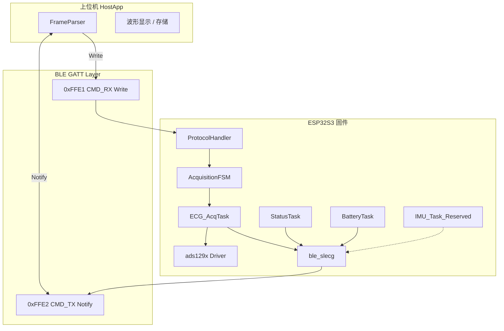
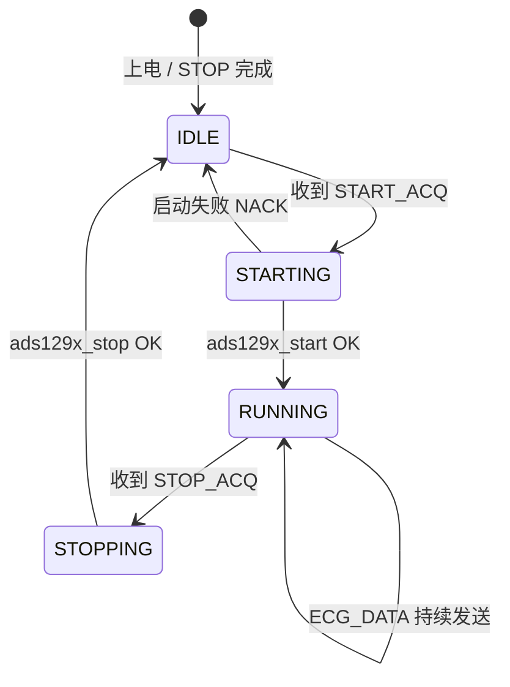

# 01 — 系统架构

## 1. 总体架构

SLECG 蓝牙协议位于 **GATT 传输层之上**，作为应用层二进制帧协议。上位机与 ESP32S3 之间通过两条 GATT 特征值交换数据：



## 2. 模块职责

| 模块 | 职责 | 当前代码状态 |
|------|------|--------------|
| `ble_slecg` | BLE 栈、GATT 服务、Notify 发送 API | 已实现 |
| `ProtocolHandler` | 帧解析、指令分发、帧封装 | 待实现 |
| `AcquisitionFSM` | 采集状态机 | 待实现 |
| `ECG_AcqTask` | DRDY 触发读帧、组包、Notify | 待实现 |
| `StatusTask` | 周期性上报 DEVICE_STATUS | 待实现 |
| `IMU_Task` | LSM6DS3TR 读取、上报 IMU_DATA | 预留，未实现 |
| `ads129x` | ADS1291 SPI 驱动、250 Hz RDATAC | 已实现 |

## 3. 采集状态机

设备在收到 START/STOP 指令后按以下状态迁移：



| 状态 | 行为 |
|------|------|
| **IDLE** | ADS129x 未处于 RDATAC；不上报 ECG_DATA；BLE状态包正常上报 |
| **STARTING** | 调用 `ads129x_init_start()` 或 `ads129x_start()`；成功则 ACK 并进入 RUNNING |
| **RUNNING** | DRDY 250 Hz 读帧；每 25 样本封 ECG_DATA 包 Notify |
| **STOPPING** | 调用 `ads129x_stop()`；ACK 后回到 IDLE |

## 4. 建议任务划分

### 4.1 ECG_AcqTask（高优先级）

- **触发方式**：DRDY GPIO 下降沿中断 + 信号量，或高优先级轮询 `ads129x_is_data_ready()`
- **频率**：250 Hz
- **流程**：
  1. 等待 DRDY
  2. `ads129x_read_frame(&sample)`
  3. 将 `sample.ch1_value` 写入环形缓冲
  4. 缓冲满 25 点时封装 ECG_DATA 帧，调用 `ble_slecg_send_notify()`
- **仅在 RUNNING 状态执行**

### 4.2 ProtocolHandler（BLE 回调上下文或专用任务）

- 在 GATT Write 回调中接收原始字节
- 按帧格式解析 TYPE / LEN / PAYLOAD
- 分发 START_ACQ / STOP_ACQ / REQ_STATUS
- 发送 ACK / NACK

### 4.3 StatusTask（低优先级）

- 周期：**1 Hz**
- 组装 DEVICE_STATUS 帧并 Notify
- 收到 REQ_STATUS 时立即额外发送一包

### 4.4 IMU_Task（预留）

- 周期：**50 Hz**（LSM6DS3TR 启用后）
- 当前阶段不创建此任务，协议格式已定义

## 5. 数据流（ECG 采集运行时）

```
ADS1291 DRDY (250 Hz)
    ↓
ads129x_read_frame()
    ↓
ads129x_sample_t.ch1_value (int16)
    ↓
环形缓冲 [25 samples]
    ↓
封装 ECG_DATA 帧 (65 B)
    ↓
ble_slecg_send_notify() → 0xFFE2
    ↓
上位机 FrameParser → 波形显示
```

## 6. 错误与发送策略

| 场景 | 处理方式 |
|------|----------|
| START 时 ADS129x 未就绪 | NACK，`error=1`（SPI 失败） |
| RUNNING 时 DRDY 超时 | 置 STATUS `error_code=2`，可选 STOP |
| Notify 发送失败 / 队列满 | 丢弃当前 ECG 包，置 STATUS `error_code=3` |
| 收到未知 TYPE | 忽略或 NACK |
| 帧 SYNC/FOOT 不匹配 | 丢弃该帧，继续搜索下一 SYNC |

## 7. 实现约束

1. **GATT 映射不变**：下行 Write → `0xFFE1`，上行 Notify → `0xFFE2`
2. **一帧一次传输**：不在 GATT 层做分包/粘包；应用层帧必须 ≤ 512 B
3. **无 CRC**：完整性依赖 BLE 链路层 CRC 与帧头帧尾校验
4. **IMU预留**：驱动未就绪前固件不发送，不影响ECG主流

## 8. 相关文件

| 文件 | 说明 |
|------|------|
| [`main/main.c`](../main/main.c) | 应用入口，待接入协议与采集任务 |
| [`main/board_pins.h`](../main/board_pins.h) | GPIO 定义 |
| [`components/ads129x/ads129x.h`](../components/ads129x/ads129x.h) | ECG 驱动 API |
| [`components/ble_slecg/ble_slecg.h`](../components/ble_slecg/ble_slecg.h) | BLE GATT API |
