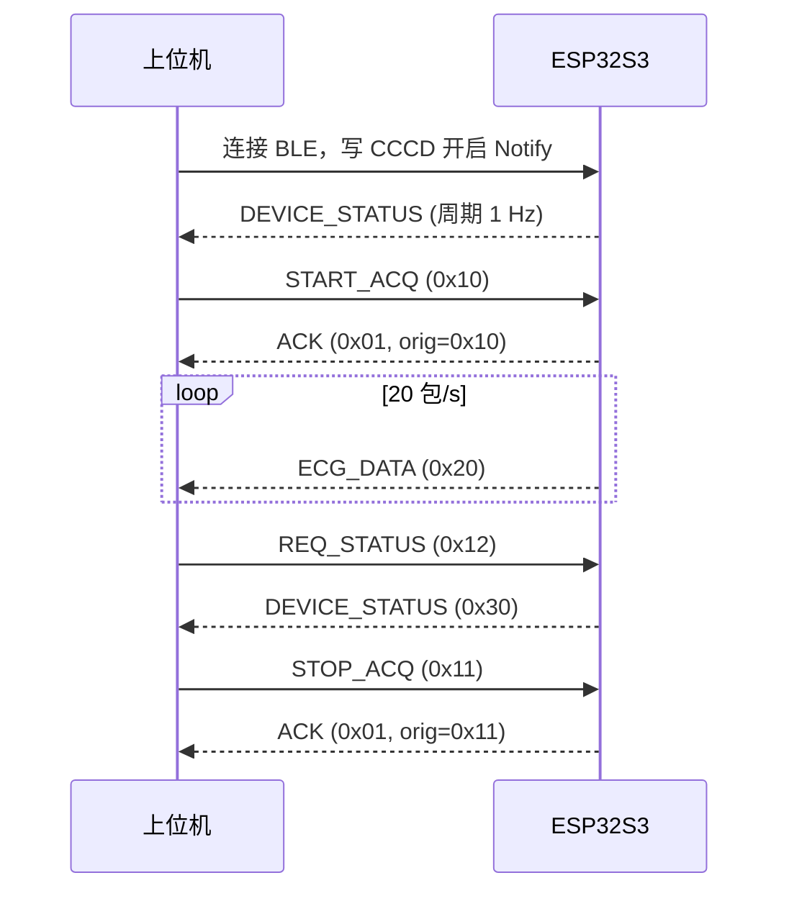

# 04 — 下行指令（上位机 → 设备）

上位机通过 GATT 特征 **0xFFE1（CMD_RX）** 发送 Write 或 Write Without Response，载荷为完整协议帧。

## 1. 指令一览

| TYPE | 名称 | PAYLOAD | 帧长 | 说明 |
|------|------|---------|------|------|
| `0x10` | START_ACQ | 2 B | 10 B | 开始 ECG 采集 |
| `0x11` | STOP_ACQ | 1 B | 9 B | 停止 ECG 采集 |
| `0x12` | REQ_STATUS | 0 B | 8 B | 请求立即上报状态 |

设备对 START/STOP 应答 **ACK** 或 **NACK**；REQ_STATUS 触发一包 DEVICE_STATUS，无专用 ACK。

## 2. START_ACQ（0x10）

### 2.1 PAYLOAD 结构

| 偏移 | 字段 | 长度 | 类型 | 说明 |
|------|------|------|------|------|
| 0 | mode | 1 | uint8 | 采集模式 |
| 1 | flags | 1 | uint8 | 功能标志位 |

**mode 取值：**

| 值 | 含义 |
|----|------|
| `0x00` | 正常单导 ECG（默认） |
| 其他 | 保留，设备应 NACK |

**flags 位定义：**

| Bit | 名称 | 说明 |
|-----|------|------|
| 0 | IMU_SYNC | 启用 IMU 同步采集（预留，当前忽略） |
| 1~7 | — | 保留，置 0 |

### 2.2 设备行为

1. 若当前已在 RUNNING → NACK，`error=4`（已在采集）
2. 若 ADS129x 未就绪 → NACK，`error=1`
3. 调用 `ads129x_start()` → 成功则 ACK，进入 RUNNING
4. DRDY 任务开始组包发送 ECG_DATA

### 2.3 完整帧 Hex 示例

正常启动单导 ECG（mode=0, flags=0）：

```
A5 5A 10 02 00 00 00 5A A5
```

| 字节 | 含义 |
|------|------|
| `A5 5A` | SYNC |
| `10` | START_ACQ |
| `02 00` | LEN = 2 |
| `00` | mode = 正常 |
| `00` | flags = 0 |
| `5A A5` | FOOT |

### 2.4 成功应答

```
A5 5A 01 02 00 10 00 5A A5
              │  │
              │  └─ result = 0
              └──── orig_type = 0x10
```

## 3. STOP_ACQ（0x11）

### 3.1 PAYLOAD 结构

| 偏移 | 字段 | 长度 | 类型 | 说明 |
|------|------|------|------|------|
| 0 | reserved | 1 | uint8 | 固定 `0x00` |

### 3.2 设备行为

1. 若当前为 IDLE → ACK（幂等，视为已停止）
2. 调用 `ads129x_stop()` → ACK，进入 IDLE
3. 停止发送 ECG_DATA

### 3.3 完整帧 Hex 示例

```
A5 5A 11 01 00 00 5A A5
```

| 字节 | 含义 |
|------|------|
| `A5 5A` | SYNC |
| `11` | STOP_ACQ |
| `01 00` | LEN = 1 |
| `00` | reserved |
| `5A A5` | FOOT |

### 3.4 成功应答

```
A5 5A 01 02 00 11 00 5A A5
```

## 4. REQ_STATUS（0x12）

### 4.1 PAYLOAD

无（LEN = 0）。

### 4.2 设备行为

立即组装并 Notify 一包 **DEVICE_STATUS（0x30）**，无需 ACK。

### 4.3 完整帧 Hex 示例

```
A5 5A 12 00 00 5A A5
```

## 5. ACK / NACK 应答格式（设备 → 上位机）

### 5.1 ACK（0x01）

| 偏移 | 字段 | 长度 | 说明 |
|------|------|------|------|
| 0 | orig_type | 1 | 所应答的指令 TYPE |
| 1 | result | 1 | `0` = 成功 |

### 5.2 NACK（0x02）

| 偏移 | 字段 | 长度 | 说明 |
|------|------|------|------|
| 0 | orig_type | 1 | 所拒绝的指令 TYPE |
| 1 | error | 1 | 错误码 |

**error 码：**

| 值 | 含义 |
|----|------|
| `0` | 无错误（不应出现在 NACK） |
| `1` | SPI / ADS129x 通信失败 |
| `2` | DRDY 超时 |
| `3` | BLE 发送队列满 |
| `4` | 状态冲突（如重复 START） |
| `5` | 参数无效（mode/flags 不支持） |

### 5.3 NACK 示例：重复 START

```
A5 5A 02 02 00 10 04 5A A5
              │  │
              │  └─ error = 4 (已在采集)
              └──── orig_type = START_ACQ
```

## 6. 典型时序



## 7. 上位机实现要点

1. 连接后先写 **0xFFE2 的 CCCD** 为 `0x0001` 开启 Notify
2. START 后等待 ACK 再开始解析 ECG_DATA
3. 超时未收到 ACK（建议 500 ms）视为失败
4. STOP 后 ECG_DATA 应在 100 ms 内停止
5. 使用 Write Without Response 可降低延迟（设备均支持）

## 8. 相关文档

- 帧格式：[03_frame_envelope.md](03_frame_envelope.md)
- 状态包字段：[../packets/device_status.md](../packets/device_status.md)
- 字段汇总：[../PACKET_FIELD_TABLE.md](../PACKET_FIELD_TABLE.md)
