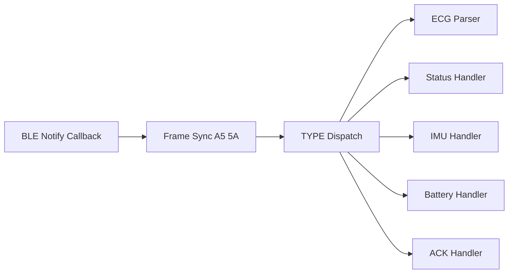

# 05 — 上行数据流

设备通过 GATT 特征 **0xFFE2（CMD_TX）** 以 Notify 方式向上位机发送数据帧。

## 1. 上行包类型与频率

| TYPE | 名称 | 频率 | 帧长 | 触发条件 |
|------|------|------|------|----------|
| `0x01` | ACK | 按需 | 10 B | 响应 START/STOP |
| `0x02` | NACK | 按需 | 10 B | 指令拒绝 |
| `0x20` | ECG_DATA | **20 Hz** | 66 B | RUNNING 状态，每 25 样本 |
| `0x30` | DEVICE_STATUS | **1 Hz** | 20 B | 周期 + REQ_STATUS |
| `0x40` | IMU_DATA | **50 Hz**（预留） | 28 B | IMU 启用后 |
| `0x50` | BATTERY_ADC | **0.2 Hz** | 13 B | 每 5 s |

## 2. 数据流优先级

```
ECG_DATA (最高，20 Hz) > IMU_DATA (50 Hz, 预留) > DEVICE_STATUS (1 Hz) > BATTERY_ADC (0.2 Hz)
```

Notify 发送冲突时，优先保证 ECG_DATA；STATUS/BATTERY 可跳过一拍。

## 3. ECG_DATA 流（0x20）

### 3.1 发送条件

- 采集状态机处于 **RUNNING**
- 环形缓冲累积 **25** 个 `ch1_value` 样本
- BLE 已连接且 CCCD 已开启

### 3.2 时序

- 500 Hz 采样 → 每 50 ms 发 1 包 → **20 包/s**
- 每包包含连续 25 个样本，无间隙、无重叠

### 3.3 丢包检测

- 上位机根据 `seq` 字段检测跳号
- `seq` 为 uint16，溢出后从 0 回绕

详见 [../packets/ecg_data.md](../packets/ecg_data.md)

## 4. DEVICE_STATUS 流（0x30）

### 4.1 发送条件

- BLE 连接后持续发送（无论是否采集中）
- 收到 **REQ_STATUS** 时立即额外发一包

### 4.2 用途

- 显示连接/采集/导联状态
- 监控错误码
- 同步 ECG 包序号与固件版本

详见 [../packets/device_status.md](../packets/device_status.md)

## 5. IMU_DATA 流（0x40，预留）

### 5.1 当前阶段

- **固件不发送** IMU_DATA
- 上位机解析器应识别 TYPE `0x40` 但不报错
- 协议格式已定义，待 LSM6DS3TR 驱动就绪后启用

### 5.2 规划参数

- 传感器：LSM6DS3TR（6 轴 IMU + 温度）
- 频率：50 Hz
- 与 ECG 时间戳均基于 `esp_timer` 毫秒计数

详见 [../packets/imu_data.md](../packets/imu_data.md)

## 6. BATTERY_ADC 流（0x50）

### 6.1 发送条件

- BLE 连接后每 **5 s** 发送
- 与采集状态无关

### 6.2 硬件

- ADC 输入：`BOARD_BAT_ADC_GPIO`（GPIO1）
- 分压系数待硬件确认，文档中留占位公式

详见 [../packets/battery_adc.md](../packets/battery_adc.md)

## 7. 上行带宽汇总

| 场景 | 包类型 | 估算带宽 |
|------|--------|----------|
| 空闲（未采集） | STATUS + BATTERY | ≈ 22 B/s |
| 采集中 | ECG + STATUS + BATTERY | ≈ 1.35 KB/s |
| 全功能（含 IMU） | 全部 | ≈ 2.75 KB/s |

详见 [02_throughput_analysis.md](02_throughput_analysis.md)。

## 8. 上位机接收架构建议



## 9. 发送失败处理（固件侧，待实现）

| 场景 | 策略 |
|------|------|
| `ble_slecg_send_notify` 返回失败 | 丢弃当前 ECG 包 |
| 连续失败 | 置 STATUS `error_code=3` |
| STATUS/BATTERY 发送失败 | 下一周期重试，不阻塞 ECG |

## 10. 相关文档

| 文档 | 内容 |
|------|------|
| [../packets/ecg_data.md](../packets/ecg_data.md) | ECG 包详解 |
| [../packets/device_status.md](../packets/device_status.md) | 状态包详解 |
| [../packets/imu_data.md](../packets/imu_data.md) | IMU 预留格式 |
| [../packets/battery_adc.md](../packets/battery_adc.md) | 电池包详解 |
| [../PACKET_FIELD_TABLE.md](../PACKET_FIELD_TABLE.md) | 完整字段表 |
